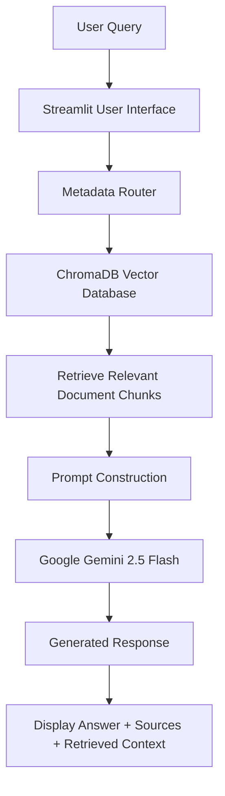

# Enterprise Data Engineering Knowledge Assistant

## Project Overview

The Enterprise Data Engineering Knowledge Assistant is an AI-powered Retrieval-Augmented Generation (RAG) application designed to help users query enterprise data engineering documentation using natural language.

Instead of relying solely on a Large Language Model (LLM), the application first retrieves the most relevant information from a structured enterprise knowledge base using ChromaDB vector search and metadata-aware retrieval. The retrieved context is then provided to Google's Gemini model to generate accurate, context-grounded responses.

The knowledge base contains multiple categories of enterprise documentation, including:

- Pipeline documentation
- SQL queries
- Operational runbooks
- Data catalogs
- Governance and PII policies

The application provides a modern Streamlit interface where users can search enterprise knowledge, inspect retrieved context, view document sources, and interact with the assistant in a conversational manner.

---

## Key Features

### Retrieval-Augmented Generation (RAG)
- Retrieves relevant enterprise documents before generating a response.
- Reduces hallucinations by grounding answers in retrieved context.

### Metadata-Aware Retrieval
- Automatically classifies user queries into document categories such as pipelines, SQL, runbooks, policies, and catalogs.
- Performs metadata filtering before semantic retrieval for more relevant search results.

### Vector Search with ChromaDB
- Stores document embeddings in a persistent ChromaDB vector database.
- Retrieves the most semantically similar document chunks for each query.

### Google Gemini Integration
- Generates natural language responses using Google's Gemini model.
- Uses retrieved context as the only source of information for answer generation.

### Enterprise Knowledge Base
The knowledge base is organized into multiple document categories:

- Pipeline Documentation
- SQL Queries
- Operational Runbooks
- Data Catalogs
- Governance & PII Policies

### Interactive Streamlit Interface
- Clean and responsive user interface.
- Previous question history.
- Source document display.
- Retrieved context viewer.
- Response time tracking.

### Secure Configuration
- API keys managed using environment variables (`.env`).
- Sensitive credentials excluded from version control using `.gitignore`.

---

## Tech Stack

| Category | Technologies |
|----------|--------------|
| Programming Language | Python 3 |
| User Interface | Streamlit |
| Large Language Model | Google Gemini 2.5 Flash |
| Vector Database | ChromaDB |
| Embedding Model | Sentence Transformers (`all-MiniLM-L6-v2`) |
| Retrieval Method | Semantic Search + Metadata Filtering |
| Environment Management | Python Virtual Environment (`venv`) |
| Configuration Management | python-dotenv |
| Version Control | Git & GitHub |

---

## System Architecture



### Workflow

1. The user submits a question through the Streamlit interface.
2. The Metadata Router classifies the query into the appropriate document category (Pipelines, SQL, Runbooks, Policies, or Catalogs).
3. ChromaDB performs semantic vector search within the selected document category.
4. The most relevant document chunks are retrieved.
5. A structured prompt is constructed using the retrieved context and the user's question.
6. Google Gemini generates a response using only the retrieved context.
7. The application displays:
   - Generated Answer
   - Source Documents
   - Retrieved Context
   - Response Time

---

## Project Structure

```text
enterprise-data-engineering-knowledge-assistant/
│
├── chroma_db/                      # Persistent ChromaDB vector database
│
├── data/                           # Initial sample documents
│
├── ingestion/
│   ├── ingest.py
│   ├── chunk_ingest.py
│   └── knowledge_ingest.py         # Ingests enterprise knowledge into ChromaDB
│
├── knowledge_base/
│   ├── catalogs/
│   ├── pipelines/
│   ├── policies/
│   ├── runbooks/
│   └── sql/
│
├── retrieval/
│   ├── retrieve.py
│   ├── chunk_retrieve.py
│   ├── retrieve_with_sources.py
│   └── metadata_retrieval.py       # Metadata-aware retrieval
│
├── app.py
├── rag_assistant.py
├── streamlit_app_v2.py             # Streamlit web application
│
├── requirements.txt
├── .gitignore
├── README.md
└── .env.example
```

### Directory Overview

| Directory | Description |
|-----------|-------------|
| `knowledge_base/` | Enterprise documents organized by category. |
| `ingestion/` | Scripts for processing and storing documents in ChromaDB. |
| `retrieval/` | Retrieval modules including semantic and metadata-aware search. |
| `chroma_db/` | Persistent vector database generated after ingestion. |
| `streamlit_app_v2.py` | Main web interface for interacting with the assistant. |

---

## Knowledge Base Structure

The assistant retrieves information from a structured enterprise knowledge base organized into multiple document categories. Each category represents a different aspect of a data engineering environment and enables metadata-aware retrieval.

| Category | Description |
|----------|-------------|
| **Pipelines** | Stores pipeline documentation including purpose, owner, source systems, outputs, and Service Level Objectives (SLOs). |
| **SQL** | Contains frequently used SQL queries for reporting, analytics, and business insights. |
| **Runbooks** | Stores operational procedures and recovery steps for handling pipeline failures and production incidents. |
| **Catalogs** | Maintains metadata about datasets, tables, columns, and schemas used across the organization. |
| **Policies** | Contains governance rules, PII handling guidelines, and security policies for enterprise data. |

This structured organization allows the application to classify user queries before retrieval, improving search relevance and reducing unnecessary searches across unrelated document types.

---

## How It Works

The Enterprise Data Engineering Knowledge Assistant follows a Retrieval-Augmented Generation (RAG) pipeline to generate reliable, context-aware responses.

### Step 1: User Query

The user submits a question through the Streamlit interface using natural language.

**Example:**

```text
Who owns the customer pipeline?
```

---

### Step 2: Metadata Classification

The application analyzes the user's query and determines the appropriate document category.

Examples include:

- Pipelines
- SQL
- Runbooks
- Policies
- Catalogs

This reduces the search space before semantic retrieval.

---

### Step 3: Vector Retrieval

The selected document category is searched using ChromaDB.

Documents are stored as vector embeddings generated using the Sentence Transformers embedding model.

The most relevant document chunks are retrieved based on semantic similarity.

---

### Step 4: Prompt Construction

The retrieved document chunks are combined with the user's question to create a structured prompt.

Only the retrieved context is provided to the Large Language Model.

---

### Step 5: Response Generation

Google Gemini generates an answer using the retrieved context.

This grounding process significantly reduces hallucinations and ensures that responses remain relevant to the enterprise knowledge base.

---

### Step 6: Display Results

The Streamlit interface presents:

- Generated Answer
- Source Documents
- Retrieved Context
- Previous Questions
- Response Time

---

## Installation

### 1. Clone the Repository

```bash
git clone https://github.com/kanikapitaliya/rag-data-engineering-assistant.git

cd rag-data-engineering-assistant
```

### 2. Create a Virtual Environment

```bash
python -m venv venv
```

Activate the virtual environment.

**Windows**

```bash
venv\Scripts\activate
```

**Linux / macOS**

```bash
source venv/bin/activate
```

### 3. Install Dependencies

```bash
pip install -r requirements.txt
```

### 4. Configure Environment Variables

Create a `.env` file in the project root.

```text
GEMINI_API_KEY=your_api_key_here
```
Copy `.env.example` to `.env` and replace the placeholder with your own Gemini API key.

> **Note:** Obtain a free Gemini API key from Google AI Studio.

### 5. Build the Knowledge Base

Run the ingestion script to create the ChromaDB vector database.

```bash
python ingestion/knowledge_ingest.py
```

### 6. Launch the Application

```bash
streamlit run streamlit_app_v2.py
```

The application will open automatically in your default web browser.

---

## Example Queries

The following are sample questions that can be asked through the application.

### Pipeline Information

```text
Who owns the customer pipeline?
```

```text
What is the customer pipeline SLO?
```

---

### SQL Queries

```text
Show me the revenue SQL query.
```

---

### Runbooks

```text
How do I recover the customer pipeline after a database outage?
```

---

### Data Governance

```text
Which fields are considered PII?
```

---

### Metadata

```text
Which table contains customer information?
```

---

The assistant automatically classifies each query, retrieves the most relevant documents from the knowledge base, and generates an answer grounded in the retrieved context.

---

## Future Improvements

The current implementation demonstrates a complete metadata-aware Retrieval-Augmented Generation (RAG) pipeline. Future enhancements may include:

- Conversation memory across sessions
- User authentication and role-based access
- Multi-document retrieval and reranking
- Support for additional enterprise knowledge sources
- Cloud deployment
- Feedback collection for response quality
- Hybrid keyword and semantic retrieval

---

## Author

**Kanika Pitaliya**

M.Sc. Data Analytics

GitHub: https://github.com/kanikapitaliya

---
